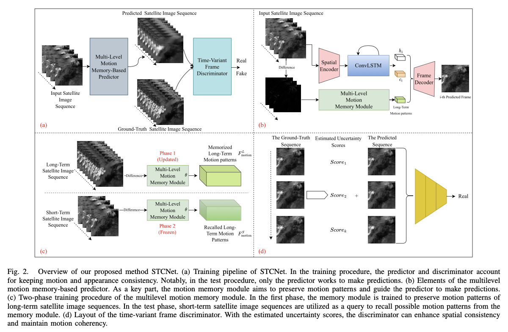

# STCNet

code for learning spatial-temporal consistency for satellite image sequence prediction




## Summary
We provide the [pretrained model](https://drive.google.com/file/d/1PstTvOV2KPLEUF5qg6f3fiMUIUogN5vE/view?usp=drive_link) and test script for 4-hour satellite nowcasting over the China mainland.


## Comparsion Samples


The ground-truth 4-hour sequences:


Pred 4-hour satellite sequences:


## Test
make satellite nowcasting over the China mainland area.
```
bash test_bash.sh
```


## Citation

If you are interested in our repository or our paper, please cite the following papers:

```

@article{dai2023learning,
  title={Learning Spatial-Temporal Consistency for Satellite Image Sequence Prediction},
  author={Dai, Kuai and Li, Xutao and Ma, Chi and Lu, Shenyuan and Ye, Yunming and Xian, Di and Tian, Lin and Qin, Danyu},
  journal={IEEE Transactions on Geoscience and Remote Sensing},
  volume={61},
  pages={3303947},
  year={2023}
}
```